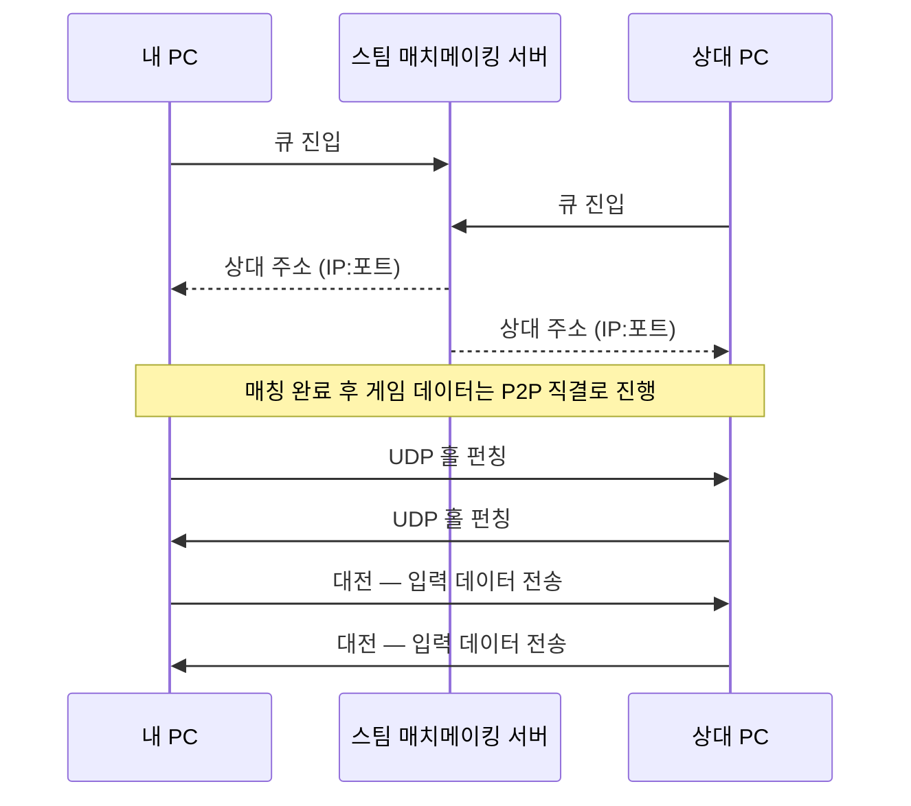

# 렉은 왜 생기는가 — 이 도구가 재는 것의 배경

`monitor.py`가 무엇을 재는지가 아니라, **왜 그걸 재야 하는지**를 다룬 문서다.
네트워크 개념 7개를 다루고, 마지막에 이 저장소의 실측 로그로 검증한다.

| 문서                               | 답하는 질문                                         |
| ---------------------------------- | --------------------------------------------------- |
| **NETWORK.md** (여기)              | **왜 이런 게 문제인가** — 네트워크 개념과 렉의 원인 |
| [README.md](README.md)             | 이게 뭔가 — 프로젝트 소개와 실측 결과               |
| [ARCHITECTURE.md](ARCHITECTURE.md) | 어떻게 도는가 — 실행 흐름, 스레드, 데이터 경로      |
| [FINDINGS.md](FINDINGS.md)         | 왜 그 값인가 — 상수의 실측 근거                     |
| [USAGE.md](USAGE.md)               | 어떻게 쓰나 — 실행, 출력 필드, 트러블슈팅           |

> 상대 IP는 개인정보다. 이 문서에는 집계값만 있고 IP는 없다.

---

## 0. 한 장 요약

```
SC6는 늦은 패킷을 못 되감는다 → 그냥 멈춰 기다린다 = 굶은 프레임
                    ↓
        패킷이 16.7ms마다 오는가  ← 이 도구가 재는 건 이것 하나
                    ↓
   ┌────────────────┴────────────────┐
수동 — 상대 패킷을 본다          능동 — 내가 핑을 쏜다
도착 간격 → 지터 · 갭            왕복 시간 → RTT
TrafficWindow → Flow             Pinger
   └────────────────┬────────────────┘
                    ↓
        화면 · 로그 · 판 요약 (16.7ms에서 벗어난 양)
```

한 문장으로 남길 것:

> **평균 핑이 아니라 '도착 간격이 튀는 순간'이 체감을 좌우한다.**

---

## 1. 대전이 잡히면 네트워크에서 무슨 일이 일어나는가

### 6하원칙

|            |                                                                                                           |
| ---------- | --------------------------------------------------------------------------------------------------------- |
| **누가**   | 내 PC ↔ 상대 PC. 중간에 스팀 매치메이킹 서버(중매만), 양쪽 공유기(NAT), ISP 라우터                        |
| **언제**   | 매칭 성립 직후 연결 수립(1~2초) → 대전 내내 → 판 종료 시 정리                                             |
| **어디서** | 내 랜카드 → 내 공유기 → ISP → 백본 → 상대 ISP → 상대 공유기 → 상대 PC                                     |
| **무엇을** | UDP 데이터그램. "몇 번 프레임에 무슨 버튼을 눌렀다" — 수십 바이트. 초당 65개씩 양방향                     |
| **어떻게** | 서버가 서로의 주소를 알려주고, 양쪽이 동시에 쏴서 NAT에 구멍을 뚫는다(홀 펀칭). 실패하면 밸브 릴레이 경유 |
| **왜**     | 서버를 거치면 왕복 거리가 두 배. 격투게임은 지연이 전부라 직결이 아니면 게임이 안 된다                    |

```
                  ┌──────────────┐
                  │  스팀 서버   │  ① 매칭 — 서버 경유
                  │ 상대를 찾아줌│
                  └──────────────┘
                    ╱          ╲
                (점선)        (점선)
                  ╱              ╲
     ┌───────────┐  ②직결(UDP)  ┌────────────┐
     │ 내 공유기 │◄────────────►│ 상대 공유기│
     └───────────┘               └────────────┘
           │                           │
     ┌───────────┐               ┌────────────┐
     │   내 PC   │               │  상대 PC   │
     └───────────┘               └────────────┘
```

위 그림이 _누가_ 라면, 아래는 _언제_ 다. 매칭이 끝나는 순간 통신 상대가 서버에서
상대 PC로 갈아타는 지점이 보인다.



### NAT가 왜 문제인가

공유기 뒤의 내 주소는 `192.168.0.x` 같은 **사설 IP**다. 인터넷에서 못 찾아온다.

- 밖으로 나갈 때: 공유기가 공인 IP로 바꿔치기하고 "응답이 오면 누구에게 줄지" 매핑을 기억한다
- **밖에서 먼저 들어올 때: 누구에게 줄지 모르니 버린다**

양쪽 다 공유기 뒤에 있으면 서로 먼저 부를 수가 없다. 이게 P2P의 근본 문제다.

### 홀 펀칭 — 동시에 쏴서 뚫는다

1. 둘 다 스팀 서버에 접속 (클라이언트→서버라 NAT 통과 문제 없음)
2. 서버가 서로에게 **상대의 공인 IP:포트**를 알려준다 ← 서버 역할은 여기까지
3. 내가 상대 주소로 UDP를 쏜다. 상대 공유기는 버리지만 **내 공유기에 매핑이 생긴다**
4. 상대도 동시에 쏜다 → 상대 공유기에도 매핑이 생긴다
5. 이제 양쪽에 구멍이 뚫려 **다음 패킷부터 통과한다**

처음 몇 발은 버려진다. 그래서 연결 수립 단계가 비대칭으로 보인다 — 이 저장소의 실측:

```
매칭 잡담   79pkt/s  ↑72 ↓7    ← 나만 쏘고 상대는 거의 답이 없다
연결 수립   96pkt/s  ↑66 ↓30   ← 구멍이 뚫리는 중
실제 대전  132pkt/s  ↑66 ↓66   ← 완전히 대칭
```

(monitor.py 82~84)

이 세 단계가 `MIN_DOWN_RATIO`(0.25)와 `MATCH_START_SYMMETRY`(0.8) 두 문턱의 근거다.

### 홀 펀칭이 실패하면 — 릴레이

NAT 종류에 따라 안 뚫린다(대칭형 NAT, CGNAT 등). 그러면 밸브가 깔아둔 중계 서버(SDR)를 경유한다.

- 지연이 늘어난다 (중계소를 찍고 감)
- **상대 IP가 안 보인다** → 이 도구는 `릴레이 경유 매치 ― 측정 불가`를 띄운다

밸브 대역을 통째로 제외 목록에 넣어둔 이유가 이것이다(monitor.py 164). 릴레이를 상대로 착각하면
ICMP를 100% 막는 서버에 핑을 쏘게 되어 아무것도 못 잰다.

---

## 2. TCP vs UDP — 왜 게임은 UDP인가

흔한 답("TCP는 신뢰성, UDP는 속도")은 틀리진 않지만 얕다. 핵심은 하나다.

> **TCP의 재전송은 "늦게라도 도착시킨다"인데, 게임에서 늦게 온 입력은 이미 쓸모가 없다.**

3번 프레임 입력이 유실됐다고 하자. TCP는 재전송한다(왕복 한 번 추가). 도착할 때쯤이면
게임은 이미 7번 프레임이다. **3번은 이제 쓸 데가 없다.**

### 진짜 문제는 HOL 블로킹

TCP는 순서를 보장하므로, 3번이 도착할 때까지 **4·5·6번을 받아놓고도 안 준다.**

```
받은 것       : [3 유실] [4 도착] [5 도착] [6 도착]
TCP가 주는 것 : ......아무것도. 3번 올 때까지 대기
```

하나가 막히면 뒤가 전부 막힌다 = **Head-of-Line 블로킹**.
한 개 유실이 **한 개의 손실이 아니라 수십 ms의 정지**로 증폭된다.

UDP는 순서도 재전송도 안 한다. 3번이 없으면 4번을 그냥 준다.
**"잃는 게 늦는 것보다 낫다"** — 실시간 통신의 원칙.

---

## 3. 딜레이 넷코드란 무엇인가

> 딜레이 기반과 롤백의 차이 자체는 Ars Technica의
> [Explaining how fighting games use delay-based and rollback netcode](https://arstechnica.com/gaming/2019/10/explaining-how-fighting-games-use-delay-based-and-rollback-netcode/)가
> 그림과 함께 정리해 뒀다. 이 절은 그 구분을 **이 도구가 실제로 재는 값**과
> 이어 붙이는 데 집중한다.

### 근본 문제

격투게임은 두 PC가 완전히 같은 화면을 그려야 한다. 그래서 **결정론적 시뮬레이션**을 쓴다.
게임 상태를 주고받는 게 아니라 **입력만 주고받고 양쪽이 각자 똑같이 계산**한다.
주고받는 데이터가 수십 바이트로 끝나는 이유다.

문제: **N번 프레임을 계산하려면 상대의 N번 입력이 있어야 한다.** 없으면?

```
        상대 입력이 아직 안 왔다
                  │
      ┌───────────┴───────────┐
  딜레이 — 기다린다      롤백 — 추측하고 진행
  화면이 멈춘다          틀리면 되감아 재계산
  상태는 언제나 정확     화면이 순간 튄다
  (SC6, 철권)            (길티기어, 스파6)
```

### "딜레이"는 일부러 넣는 지연이다

버튼을 누르면 즉시 반영하지 않고 **N프레임 뒤에 적용하기로 약속**한다.
그 N프레임이 패킷이 날아올 시간을 벌어준다.

- **평소**: N프레임 안에 도착 → 화면은 완벽히 부드럽다. 대신 **내 입력이 항상 늦게 나간다**
- **늦으면**: 계산할 수가 없다 → **그냥 멈춘다** ← 이게 `starved_frames`

### 롤백은 낙관적으로 진행한다

상대 입력이 없으면 "직전이랑 같겠지"라고 추측하고 계산한다. 입력 지연이 0이다.
진짜 입력이 도착했을 때 틀렸으면 **그 프레임으로 되감아 다시 계산**한다.
대가는 **화면이 튀는 것**. 하지만 멈추지는 않는다.

|                | 딜레이 기반 | 롤백                  |
| -------------- | ----------- | --------------------- |
| 평소 입력 지연 | 항상 있음   | 거의 0                |
| 지연이 튈 때   | **멈춘다**  | 화면이 튄다           |
| 구현 난이도    | 낮음        | 높음 (상태 저장·복원) |

---

## 4. 렉의 정체는 무엇인가

**"렉"은 한 가지가 아니다.** 최소 네 가지가 섞여 있다.

| 이름              | 증상                       | 원인 층                  |
| ----------------- | -------------------------- | ------------------------ |
| **지연**(latency) | 입력이 굼뜨다              | 물리적 거리, 경로        |
| **지터**(jitter)  | 멀쩡하다가 **툭툭 멈춘다** | 큐잉, 경로 불안정        |
| **손실**(loss)    | 순간적으로 건너뛴다        | 혼잡, 무선 간섭          |
| **프레임 드랍**   | 화면이 끊긴다              | **네트워크가 아니라 PC** |

**딜레이 기반 넷코드에서 "렉"이라 느끼는 건 거의 전부 두 번째, 지터다.**

### 왜 평균이 아니라 지터인가

지연이 **항상** 80ms면 입력이 굼뜨지만 **일관된다.** 사람은 일관된 지연에 적응한다.
문제는 30ms였다가 250ms였다가 하는 것. 적응할 대상이 없고, 250ms짜리가 올 때마다 멈춘다.

```
회선 A  ●●●●●●●●●●                         ← 다 비슷한 시간에 도착
회선 B  ●●●●●●●●              ⬤       ⬤   ← 대부분 더 빠른데 두 개가 멀리
        └──────────── 오른쪽일수록 느림 ──────────►
```

**회선 B의 패킷은 대부분 A보다 빠르다.** 그런데 사람은 B를 "렉 걸린다"고 말한다.
평균으로는 이 차이가 안 보인다. B의 문제는 "느리다"가 아니라 **"가끔 아주 느리다"**다.

그래서 이 도구는 평균 대신 **중앙값과 p95**를 쓴다:

```python
self.median_gap = statistics.median(ordered)     # 평범한 때는 어떤가
self.p95_gap = ordered[...]                      # 나쁜 5%는 어떤가
self.jitter = self.p95_gap - self.median_gap     # 흔들림의 폭
```

(monitor.py 676~680)

### 지터는 왜 생기나 — 큐잉 지연

라우터와 공유기는 처리할 수 있는 것보다 많이 들어오면 **버퍼에 줄을 세운다.**
줄이 길어지면 내 게임 패킷도 그 뒤에 선다. 회선이 "끊긴" 게 아니라 **줄을 서느라 늦는 것**이다.

- 줄이 비어 있을 때 온 패킷: 16ms
- 줄이 20개 밀렸을 때 온 패킷: 200ms

**같은 회선인데** 순간마다 다르다. 이게 지터의 정체다.

그리고 **UDP는 재전송을 안 하므로 유실된 패킷은 영영 안 온다.**
게임 화면에서는 **손실과 지연이 같은 증상**으로 보인다.

---

## 5. 스트리밍(+VPN)을 켜고 게임하면 무슨 일이 일어나는가

**오해부터 걷어내면 — "대역폭이 모자라서"가 아니다.**

| 송출         | 1080p60 기준        |
| ------------ | ------------------- |
| 트위치       | 약 6,000 kbps       |
| 유튜브       | 약 4,500~9,000 kbps |
| 치지직       | 약 8,000 kbps       |
| **합계**     | **약 20 Mbps**      |
| **게임 P2P** | **약 0.05 Mbps**    |

게임은 송출 하나의 0.5%도 안 쓴다. 그런데 피해자는 게임이다.
**대역폭 싸움에서 지는 게 아니라 줄 서기에서 지는 것.**

```
 게임 P2P    ─┐
 치지직 송출 ─┤
 유튜브 송출 ─┼──►  공유기 업링크 (하나뿐인 통로)  ──►  인터넷
 트위치(VPN) ─┘
```

### 영향 1 — 키프레임 버스트 (놓치기 쉬움)

영상 인코더는 균등하게 뱉지 않는다. 2초마다 **키프레임(I-frame)**을 내는데
화면 전체를 담아서 **일반 프레임의 5~10배 크기**다.

```
평상시 프레임 :  ▪ ▪ ▪ ▪ ▪ ▪ ▪ ▪
2초마다      :  ████████  ← 순간적으로 수 MB
```

송출이 셋이면 각자 자기 주기로 키프레임을 내고, 셋이 겹치는 순간이 온다.
그때 순간 송신량이 평균의 몇 배로 튀고 **큐가 찬다.**

> **평균은 20Mbps인데 순간 최대는 100Mbps를 넘는다.** 게임을 멈추는 건 평균이 아니라 그 순간.

회선 사용률 그래프는 20%로 평온한데 게임은 2초마다 툭툭 멈추는 상황이 이것이다.

### 영향 2 — VPN. 가장 위험한 지점

**설정 하나에 따라 영향이 0이 되거나 치명적이 된다.**

|             | 스플릿 터널링 O     | 스플릿 터널링 X                  |
| ----------- | ------------------- | -------------------------------- |
| 게임 경로   | 내 PC → 상대 (직결) | 내 PC → **해외 VPN 서버** → 상대 |
| 게임 RTT    | 25ms                | **80~150ms**                     |
| NAT 홀 펀칭 | 정상                | **실패 확률 급증** → 릴레이 강제 |

VPN 서버는 수천 명이 공유하는 대칭형 NAT인 경우가 많다. 홀 펀칭이 실패하기 딱 좋은 조건이다.

**→ OBS(송출 프로그램)만 VPN을 타게 하는 앱 단위 스플릿 터널링이 필수.**

스플릿 터널링을 해도 남는 비용:

| 항목             | 영향                                                                                       |
| ---------------- | ------------------------------------------------------------------------------------------ |
| 캡슐화 오버헤드  | WireGuard 약 60바이트/패킷 → 실효 대역폭 3~5% 감소                                         |
| MTU 축소         | 1500 → 1420 등. 세그먼트가 늘어 **패킷 개수 증가**                                         |
| 암호화 CPU       | AES-NI 있으면 미미                                                                         |
| VPN 서버 혼잡    | 저가 VPN은 서버 자체가 병목                                                                |
| **TCP over TCP** | OpenVPN을 **TCP 모드**로 쓰면 최악. RTMP(TCP)를 TCP 터널에 태우면 재전송이 이중으로 걸린다 |

**→ VPN은 반드시 UDP 모드(WireGuard 또는 OpenVPN UDP)로.**

### 영향 3 — 내가 상대의 렉 원인이 된다

3중 인코딩은 CPU/GPU를 크게 먹는다. 그러면 **게임의 프레임 루프가 흔들린다.**
그리고 결정적으로:

```python
# 간격은 '들어오는' 패킷만 본다. 내보내는 쪽은
# 내 게임의 프레임 루프가 정하는 값이라 회선 상태와 무관하다.
#                                          monitor.py:760
```

**게임의 패킷 송신은 프레임 루프에 묶여 있다.** 내 PC가 버벅이면 내 송신 간격이 흔들리고,
그건 상대 화면에서 **도착 간격의 갭**으로 나타난다.

```
내 CPU 포화 → 내 게임 프레임 드랍 → 내 송신 간격 불규칙
                                        ↓
                              상대가 겪는 "렉"
```

**내 회선은 멀쩡한데 내가 렉의 원인이다. 그리고 내 화면에서는 안 보인다.**

### 위험도 순위

| 순위 | 원인                               | 게임 영향                           | 대책 난이도      |
| ---- | ---------------------------------- | ----------------------------------- | ---------------- |
| 1    | **VPN 전체 터널**                  | RTT 3배 + 릴레이 강제. 치명적       | 쉬움 (설정 하나) |
| 2    | **CPU/GPU 포화 → 프레임 드랍**     | 내 화면 끊김 + **상대에게 렉 유발** | 중간             |
| 3    | **키프레임 버스트 → 큐잉**         | 2초 주기로 툭툭 멈춤                | 중간             |
| 4    | **업로드 상시 포화** (비대칭 회선) | 상시 수백 ms 지연                   | 회선에 달림      |
| 5    | VPN 오버헤드·MTU                   | 수 % 수준                           | 낮음             |

### 실전 체크리스트

1. **스플릿 터널링 필수.** 송출 프로그램만 VPN. 게임은 절대 태우지 않기
2. **VPN은 UDP 모드**(WireGuard 우선)
3. **3중 송출 대신 재배포 서비스**(Restream 등)로 한 번만 올리기 → 업로드 1/3. **효과가 가장 큼**
4. **송출 총합을 회선 업로드의 60~70% 이하로** — 버스트를 흡수할 여유
5. **공유기에 SQM / FQ-CoDel** — 병목을 내가 제어하는 지점으로
6. **하드웨어 인코더**, 가능하면 **송출 전용 PC 분리** → 영향 2·3이 통째로 사라짐
7. **유선.** 이 상황에서 Wi-Fi는 논외

---

## 6. 같은 나라 상대인데 왜 외국 상대가 더 깨끗하게 느껴지나

> **체감 품질을 정하는 건 거리(RTT)가 아니라 안정성(지터)이다.**
> 그리고 딜레이 넷코드는 **RTT는 흡수할 수 있지만 지터는 못 흡수한다.**

```
국내 상대  [ 버퍼 ]●●●●●        ⬤        ⬤     ← 버퍼가 좁아 두 번 넘침
해외 상대  [ 버 퍼 는  넓 다 ●●●●●● ]              ← 더 늦게 와도 안 넘침
           └──────────── 오른쪽일수록 느림 ──────────►
```

**해외 상대의 패킷은 국내 상대의 "늦은" 패킷보다도 늦게 온다. 그런데 안 멈춘다.**

지연이 높은 상대와는 딜레이 프레임 N을 크게 잡으니 패킷이 좀 늦어도 약속한 시간 안에 도착한다.
**"안정적으로 굼뜬" 상태**가 된다. 국내 상대는 N이 작아 **조금만 흔들려도 곧바로 넘친다.**

- 국내 상대 = **빠르지만 예측 불가** → "렉 걸린다"
- 해외 상대 = **느리지만 예측 가능** → "깨끗하다"

사람은 절대적 느림보다 **예측 불가능성**을 훨씬 강하게 인지한다.

> SC6가 딜레이 프레임을 정확히 어떻게 정하는지는 공개된 스펙이 없다.
> 그리고 **이 도구도 그 값은 못 본다** — 게임 내부 상태라 패킷 밖에서는 안 보인다.

### 왜 국내 상대가 불안정할 수 있나

거리가 짧으면 지연이 낮은 건 맞다. 하지만 **지터는 거리와 거의 무관하다.**

| 원인                      | 설명                                                                                   |
| ------------------------- | -------------------------------------------------------------------------------------- |
| **상대의 last mile**      | 진짜 병목. **국제 백본보다 동네 회선 말단이 훨씬 불안정하다**                          |
| **상대의 Wi-Fi**          | 결정적. 무선은 매체 경합·재전송으로 수십~수백 ms 지터를 만든다                         |
| **상대 집의 다른 트래픽** | 5번의 버퍼블로트                                                                       |
| **혼잡 시간대**           | 국내 저녁 8시 vs 해외 상대의 새벽 4시                                                  |
| **릴레이 경유**           | 국내 상대인데 NAT가 안 뚫려 릴레이를 타면 오히려 멀리 돌아간다                         |
| **ISP 간 경로**           | 같은 나라라도 다른 ISP면 IX를 거친다. 반면 국제 백본은 **과투자되어 있고 잘 관리된다** |

> **지연은 거리가 정하고, 지터는 회선 상태가 정한다. 그리고 게임 체감을 지배하는 건 지터다.**

인지 편향도 있다. 해외 매칭은 드물고, **표본이 적으면 인상이 과장된다.**
"체감을 근거로 결론 내리는 게 못 미더워서 측정 도구를 만들었다"가 이 프로젝트의 출발점이다.

### 하드웨어로 해결되나

```
┌─ 내 돈으로 해결되는 범위 ─┐    ┌──── 손댈 수 없는 범위 ────┐
│  내 PC — CPU · GPU        │ ─► │  ISP · 백본 · 경로        │
│  내 공유기 · 회선         │    │  상대 PC · 공유기 · 회선  │
└───────────────────────────┘    └───────────────────────────┘
```

고사양 PC + 기가 회선으로 해결되는 것:

| 원인                       | 해결?                           |
| -------------------------- | ------------------------------- |
| CPU/GPU 포화 → 프레임 드랍 | ✅                              |
| 내 업로드 포화             | ✅ (기가 **대칭**이면)          |
| 키프레임 버스트 → 큐잉     | ✅ 대부분 (파이프가 넓어지므로) |
| **VPN 전체 터널**          | ❌ **설정 문제다**              |
| **상대 쪽 원인 전부**      | ❌                              |
| **경로 원인 전부**         | ❌                              |
| **물리 거리(광속)**        | ❌                              |

확인할 것 두 가지:

1. **"기가 인터넷"이 대칭인지.** 중요한 건 다운로드가 아니라 **업로드**다
2. **ASUS 등의 QoS와 하드웨어 가속은 보통 배타적이다.** 다만 20Mbps를 1Gbps에 흘리면
   줄이 설 일이 없으므로 **QoS를 끄고 하드웨어 가속을 유지하는 쪽**이 나을 가능성이 크다

**광속의 벽** (광섬유 안에서 약 20만 km/s, 광속의 2/3):

| 구간        | 실제 경로 거리(대략) | 왕복 최소 |
| ----------- | -------------------- | --------- |
| 서울 ↔ 부산 | 약 450km             | 약 4.5ms  |
| 서울 ↔ 도쿄 | 약 1,500km           | 약 15ms   |
| 서울 ↔ LA   | 약 12,000km          | 약 120ms  |

**"기가 인터넷"의 함정**: 가입 회선이 기가라고 그 대역을 혼자 쓰는 게 아니다.
GPON 광랜은 **상향을 이웃과 공유**하고, ISP 집선 구간은 **오버서브스크립션**이다.
기가 회선은 **내 집 앞까지의 속도**지 끝까지의 보장이 아니다.

> 그래도 돈 쓰는 의미는 있다. **내 쪽을 완벽하게 만들어두면 "원인이 내가 아니다"를 확신할 수 있다.**
> 진단이 가능해진다.

---

## 7. 렉의 원인 총정리

패킷이 지나는 순서대로 쌓으면 이렇게 된다. 진단할 때도 이 순서로 짚는다.

```
┌──────────────────────────────────────────┐
│ L1  내 PC — 프레임 드랍 · 백그라운드      │  ✅ 해결 가능
├──────────────────────────────────────────┤
│ L2  내 공유기 · 회선 — 업로드 포화 · VPN  │  ✅ 해결 가능
├──────────────────────────────────────────┤
│ L3  경로 — ISP · IX · 백본 · 물리 거리    │  ❌ 식별만
├──────────────────────────────────────────┤
│ L4  상대 공유기 · 회선 — 상대 업로드 포화 │  ❌ 식별만
├──────────────────────────────────────────┤
│ L5  상대 PC — 상대의 프레임 드랍          │  ❌ 식별만
└──────────────────────────────────────────┘
```

### L1 — 내 PC

- **원인**: CPU/GPU 포화(인코딩·백그라운드), 프레임 드랍, NIC 인터럽트 조절,
  C-state·EEE 절전, 백신 실시간 검사, 윈도우 업데이트, 스팀 다운로드
- **이 도구에서**: **안 보인다.** 수신만 재니까
- **누가 겪나**: **상대가 겪는다. 나는 모른다**
- **확인**: 게임 프레임타임 그래프, 작업관리자
- **해결**: 가능

### L2 — 내 공유기 · 회선

- **원인**: 업로드 포화(버퍼블로트), **VPN 전체 터널**, Wi-Fi, QoS 설정
- **이 도구에서**: VPN은 **`로컬 IP` 한 줄로 즉시 판별**. 업로드 포화는 안 보임
- **확인**: `[*] 로컬 IP:` 줄, 유선 여부, 업로드 실측
- **해결**: 가능. **비용 0원인 것이 대부분**

### L3 — 경로 (ISP · IX · 백본)

- **원인**: 물리 거리(광속), 홉별 큐잉, IX 피크 혼잡, BGP 경로 변경, ECMP 로드밸런싱,
  ISP 집선 오버서브스크립션, GPON 상향 공유
- **증상**: **거리는 지연을, 혼잡은 지터를** 만든다
- **이 도구에서**: 간헐적 큰 갭. 시간대에 따라 달라짐
- **확인**: 같은 상대와 **다른 시간대**에 비교. 폴백 tracert의 홉 정보
- **해결**: 불가

### L4 — 상대 공유기 · 회선

- **원인**: **상대의 업로드 포화**(방송·업로드·클라우드 백업), 상대 Wi-Fi, 상대 집의 다른 트래픽
- **이 도구에서**: **수신 간격 중앙값이 프레임보다 짧아지고**(뭉침) **간헐적 큰 갭**
- **확인**: **같은 시간·같은 회선에서 다른 상대와 비교**
- **해결**: 불가

### L5 — 상대 PC

- **원인**: 상대의 프레임 드랍 → 상대 송신 간격 흔들림
- **이 도구에서**: **L4와 구별 불가.** 둘 다 "수신 갭"으로만 나타남
- **해결**: 불가

### 횡단 계층 — 게임 · 플랫폼

| 원인                      | 영향                                                   |
| ------------------------- | ------------------------------------------------------ |
| **NAT / CGNAT**           | 홀 펀칭 실패 → 릴레이 강제 → 지연 증가 + **측정 불가** |
| **딜레이 프레임 협상값**  | 값이 빡세면 작은 지터에도 스톨                         |
| **게임 넷코드 구현 품질** | 손댈 수 없음                                           |
| **상대의 ICMP 차단**      | 능동 측정 무력화 (실측 38판 중 36판)                   |

### 실전 진단 순서

| #   | 확인                                           | 결과                                                 |
| --- | ---------------------------------------------- | ---------------------------------------------------- |
| 1   | **로컬 IP가 사설 대역인가?**                   | 터널 대역이면 → **VPN 전체 터널. 여기서 끝**         |
| 2   | **유선인가?**                                  | Wi-Fi면 → 여기서 끝                                  |
| 3   | **내 업로드에 뭐가 돌고 있나?**                | 방송·백업 중이면 → 끄고 다시                         |
| 4   | ★ **같은 시간·같은 회선에서 다른 상대와 비교** | 다른 상대가 멀쩡하면 → **내 쪽 배제. L3~L5 확정**    |
| 5   | `릴레이 경유 매치`가 뜨나?                     | 뜨면 → NAT/CGNAT 문제                                |
| 6   | 갭이 **상시**인가 **간헐**인가                 | 간헐이면 → 버스트성 혼잡 (L3 또는 L4)                |
| 7   | 간격 중앙값이 **16.67ms보다 짧은가**           | 짧으면 → **뭉쳐서 도착 = 어딘가 큐가 찼다 비워졌다** |

**4번이 가장 강력하다.**

> 대조 실험 하나가 원인 절반을 지운다. **관측만으로는 상관이고, 변수를 하나만 바꿔야 인과다.**

---

## 8. 실측 검증 — 2026-08-25 ~ 08-27

위 이론이 실제 로그에서 어떻게 나타났는지. `run.log` / `run-827.log` 기준, 총 25판.

### 세션 개요

|           | `run.log` (8/25~26)    | `run-827.log` (8/27) |
| --------- | ---------------------- | -------------------- |
| 판 수     | 14판                   | 11판                 |
| 상대      | 1명 (대만 HINET, 14판) | 2명 (일본 1, **같은 대만 상대** 9판) |
| 총 갭     | 1,048회                | 1,689회              |
| 최악 등급 | B                      | **C**                |
| 핑 측정   | **전부 실패**          | 일본만 성공 (46ms)   |

### 결정적 비교 — 같은 세션, 같은 회선, 두 상대

|                  | 일본 SO-NET (2판)           | 대만 HINET (9판)      |
| ---------------- | --------------------------- | --------------------- |
| 핑               | **46.1ms** (편도 1.4프레임) | 측정 불가 (ICMP 차단) |
| 도착 간격 중앙값 | **16.8ms**                  | 16.0ms                |
| **지터 중앙값**  | **0.3~0.4ms**               | **2.9~3.3ms**         |
| **갭 빈도**      | **3.9~4.0회/분**            | **10.0~21.3회/분**    |
| **굶음 비율**    | **0.64~0.75%**              | **1.25~3.12%**        |
| 지터 / 갭 등급   | **A / A**                   | B / B~C               |

**갭이 3~5배, 지터가 10배 차이다.** 내 회선·내 PC·같은 밤에.

### 갭은 간헐적이었다

2초 창 단위 분포:

|                 | 일본     | 대만       |
| --------------- | -------- | ---------- |
| 표본            | 213개 창 | 3,199개 창 |
| **갭이 0인 창** | **95%**  | **79%**    |
| p90             | 0.0/s    | 1.0/s      |
| 최댓값          | 4.5/s    | 7.0/s      |

대만 판도 **5분의 4는 완벽했다.** 나머지 5분의 1에서 튀었다 — 전형적인 꼬리 문제.

### 도착 패턴

간격 중앙값이 일본은 **16.8ms**(프레임 16.67ms와 거의 일치), 대만은 **16.0ms**로 오히려 짧다.
**중앙값이 프레임보다 짧은데 큰 갭이 잦다** = 패킷이 뭉쳐서 온다는 신호.

```
일본  ● ● ● ● ● ● ● ● ● ● ● ●        ← 간격이 고르다
대만  ●●●●        ⬤●●●        ⬤●●●   ← 뭉쳤다가 크게 벌어진다
```

> 이건 추론이다 — 로그에는 중앙값·p95·최댓값만 있고 개별 도착 시각은 안 남는다.
> 다만 이 조합은 뭉침 말고 설명하기 어렵고, 뭉침의 전형적 원인이 **경로 어딘가의 큐잉**이다.

### 원인 추적

| #   | 관측                                        | 판정                          |
| --- | ------------------------------------------- | ----------------------------- |
| 1   | 로컬 IP가 `192.168.x.x` (사설 대역)         | VPN 전체 터널 **배제**        |
| 2   | 릴레이 경유 로그 거의 없음                  | 홀 펀칭 성공, 직결 **확정**   |
| 3   | 같은 세션에서 일본 상대는 A급               | **내 쪽 원인 배제**           |
| 4   | 대만 상대만 갭 3~5배                        | L3(경로) 또는 L4(상대)        |
| 5   | 갭이 간헐적 (79% 창은 0)                    | 상시 포화 아님 → **버스트성** |
| 6   | 간격 중앙값 16.0ms < 프레임 16.67ms         | **뭉쳐서 도착**               |
| 7   | **상대가 유튜브 송출 중이었음** (사후 확인) | ✅ **L4 확정**                |

```
상대가 유튜브로 송출한다          ← 추론
        ↓
상대의 업링크가 포화된다          ← 추론
        ↓
게임 패킷이 큐 뒤에 줄 선다       ← 추론
        ↓
내 수신 간격에 갭                 ← 측정됨
        ↓
내 화면이 멈춘다                  ← 측정됨
```

5·6번이 특히 잘 맞는다. **영상 비트레이트는 장면에 따라 오르내린다.**
같은 대만 상대와 한 9판 안에서도 갭이 **10.0 ~ 21.3회/분으로 2배 넘게 흔들린다.**
경로가 원인이라면 이렇게까지 판마다 다르기 어렵고, 송출 비트레이트 변동으로는 자연스럽게 설명된다.

### 손해 규모

|                | 일본 상대       | 대만 상대(송출 중) |
| -------------- | --------------- | ------------------ |
| 평균 굶음 비율 | **0.70%**       | **약 2.07%**       |
| 20분 대전 환산 | 약 **8초** 정지 | 약 **25초** 정지   |

기록된 최악: **26분 43초 대전에서 1,462프레임(약 24초)**,
유일한 C등급 판은 **9분 41초 동안 1,086프레임(약 18초)** 정지.

> 정직하게: **대만과 일본은 경로도 다르므로 차이 전부가 송출 탓이라고 단정할 수 없다.**
> 확증하려면 같은 상대와 **송출을 끈 상태**로 한 판이 필요하다.
> 지금 말할 수 있는 건 "메커니즘이 예측한 증상과 관측이 일치한다"까지다.

### 이 분석이 드러낸 것 셋

**① 핑으로는 아무것도 못 봤을 것이다.** 대만 상대는 ICMP를 막아 9판 내내 핑이 `측정 못 함`이었다.
**능동 측정이 통째로 무력화된 상황에서 수동 측정만으로 원인을 짚었다.**
두 갈래를 다 만든 설계 판단이 여기서 값을 했다.

**② 평균으로는 안 보였을 것이다.** 2초 창의 79%는 갭이 0이었다. 평균만 봤으면 "정상"이다.

**③ 도구의 한계도 드러났다.** 측정 창이 2초인데 키프레임 주기도 보통 2초라
**주기성은 원리상 관측 불가**다(앨리어싱). 확인하려면 창을 0.5초로 줄여야 한다.

### 등급 체계에 대한 관찰

25판에 **종합 A가 하나도 없다** — B 24판에 C 하나다. 일본 SO-NET 두 판이 흔히
"A였다"고 불리는데, 그건 **지터·갭 등급**이 A였던 것이고 종합은 핑(B) 때문에
B였다. 종합 A는 8/29에 처음 나온다([9절](#9-재검증--2026-08-29-13판)).

등급이 B에 몰린 이유는 지터 임계값:

```python
GRADE_JITTER_MS = [(2.0, "A"), (10.0, "B"), (30.0, "C")]  # 추측값   monitor.py:1485
```

대부분의 판이 2.6~3.3ms라 **간발의 차로 B**가 된다. 그런데 일본 상대는 0.3ms로 A가 나왔으니
**A가 도달 불가능한 값은 아니다.**

코드 주석이 이미 예고했다 — _"추측이다. 실측이 정상과 렉 두 극단뿐이고 중간 지대 데이터가
아예 없다. 판이 쌓이면 반드시 다시 볼 것."_ 이제 25판이 쌓였고 **중간 지대 데이터가 생겼다.**
임계값을 다시 볼 근거가 마련됐다.

---

## 9. 재검증 — 2026-08-29, 13판

같은 날 두 세션. 8장(8/25~27, 25판)과 달리 **8/25~27에는 없던 조건 두 개**가
생겼다 — 국내 상대가 A를 받았고, 같은 상대와 55분을 연속으로 관측했다.

| 세션                  | 판  | 상대 | 등급        |
| --------------------- | --- | ---- | ----------- |
| 22:00~22:49 (47분)    | 7판 | 3명  | A 3 / B 4   |
| 22:54~23:53 (59분)    | 6판 | 1명  | A 3 / B 3   |

C·D는 없었다. 누적 38판이 됐다.

### 9-1. 첫 세션 — 상대 3명 비교

|           | 한국 KT ①  | 일본 MIRAI       | 한국 KT ②   |
| --------- | ---------- | ---------------- | ----------- |
| 판        | 1판        | 4판              | 2판         |
| 등급      | **A**      | B B B B          | **A A**     |
| 핑        | 측정 못 함 | `>=`53.9~54.0ms  | 측정 못 함  |
| 지터 중앙 | 1.4ms      | 1.2~1.3ms        | **0.6ms**   |
| 지터 최대 | 2.9ms      | **58.7~211.0ms** | 1.1~18.0ms  |
| 굶음      | 0.15%      | 0.49~1.15%       | 0.06~0.41%  |

1. **종합 A가 처음 나왔다.** 8/25~27의 25판은 전부 B 아니면 C였다. 이 세 판이
   기록상 첫 A이고, 전부 국내 KT 상대다 — 지터 임계값 2.0ms가 닿는 값이라는 첫 근거.
2. **일본 4판의 B는 전부 핑 하나가 만든 등급이다.** 지터는 넷 다 A고 갭도 한 판
   말고는 A인데, 종합이 B다. 종합은 셋 중 최악이고 그 최악이 핑(편도 1.6프레임)
   이었다. 다만 그 핑은 12홉까지만 잰 **폴백 하한**이라 실제는 더 나쁠 수 있다.
3. **같은 KT인데 국내끼리 갈렸다.** 지터 중앙값이 1.4ms와 0.6ms로 두 배 넘게
   차이 난다. 나라도 ISP도 같은데 다르다 — 지터를 정하는 건 거리가 아니라는
   [6절](#6-같은-나라-상대인데-왜-외국-상대가-더-깨끗하게-느껴지나)의 국내 사례다.

### 9-2. 둘째 세션 — 같은 상대와 6판, 변수가 하나뿐인 대조

상대는 한 명(한국 · CMB 대구방송, 케이블 인터넷)이고 55분 연속이다. 내 PC·내
회선·경로·상대까지 전부 고정이므로, **판마다 달라진 것은 그 시간의 혼잡뿐**이다.

| 판  | 길이      | 핑         | 지터 중앙 | 지터 최대   | 갭   | 굶음      | 등급  |
| --- | --------- | ---------- | --------- | ----------- | ---- | --------- | ----- |
| 1   | 10분 15초 | `>=`7.9ms  | 1.2ms     | **278.7ms** | 52회 | 1.09%     | B     |
| 2   | 5분 50초  | `>=`7.8ms  | 1.0ms     | **303.9ms** | 28회 | 1.09%     | B     |
| 3   | 3분 38초  | `>=`7.8ms  | 1.1ms     | **1.6ms**   | 4회  | **0.07%** | **A** |
| 4   | 1분 44초  | `>=`7.8ms  | 1.0ms     | **161.9ms** | 8회  | 1.33%     | B     |
| 5   | 26분 03초 | `>=`7.7ms  | 1.0ms     | **275.6ms** | 77회 | 0.73%     | **A** |
| 6   | 7분 38초  | `>=`7.8ms  | 1.7ms     | 64.7ms      | 11회 | 0.35%     | **A** |

**이 표가 이 저장소의 주장을 가장 짧게 증명한다.**

```
핑     >=7.7 ─────────────────────── >=7.9    거의 상수
지터중앙  1.0 ─────────────────────── 1.7      거의 상수
굶음     0.07 ──────────────────────► 1.33     19배
         └─ 갈린 건 이것 하나뿐이다
```

평균과 중앙값으로만 보면 **여섯 판이 같은 판이다.** 핑은 6판 내내 편도 0.2프레임
(A)이고 지터 중앙값도 1.0~1.7ms에 붙어 있다. 그런데 굶은 프레임은 0.07%에서
1.33%로 19배 갈렸다.

갈린 이유는 **지터 최댓값** 하나다. 최대가 1.6ms였던 3판만 굶음 0.07%이고,
64.7~303.9ms 스파이크를 맞은 다섯 판은 0.35~1.33%다. 핑 7.8ms짜리 초근거리
상대인데 300ms 스파이크가 난다 — **거리가 만든 지연이 아니라 어딘가의 큐다.**

> 추론 하나: 상대 ISP가 케이블 인터넷(HFC)이다. 케이블은 상향 대역을 동네가
> 공유하고 전송 기회를 요청-허가로 배분해서 구조적으로 상향 지터가 튀기 쉽다.
> [6절](#6-같은-나라-상대인데-왜-외국-상대가-더-깨끗하게-느껴지나)의 "상대
> last mile이 진짜 병목"과 맞아떨어지지만, **상대가 한 명뿐이라 ISP 탓이라고
> 단정할 수는 없다.**

### 9-3. 이번엔 굶음이 문턱에서 갈렸다

```python
GRADE_STARVE_PCT = [(1.0, "A"), (3.0, "B"), (10.0, "C")]   monitor.py:1483
```

둘째 세션의 B 세 판은 굶음이 **1.09 / 1.09 / 1.33%**다. 앞의 둘은 A 경계를
**0.09%p** 차이로 놓쳤다. 8/25~27에서는 지터가 2.6~3.3ms로 임계값 2.0ms를
간발의 차로 넘어 B가 됐는데, 이번엔 같은 일이 굶음 축에서 났다.

임계값을 다시 볼 근거가 두 축 모두에 생겼다.

### 9-4. 요약이 지터를 실제보다 좋게 말한다

지터 등급은 **창별 지터의 중앙값**으로 매긴다(`monitor.py:1549`). 그래서 최대
303.9ms가 찍힌 2판도 요약에는 `지터 A`로 나온다. 등급 종합은 굶음이 잡아 주니
결과가 틀리지는 않지만, **요약 한 줄만 읽으면 "지터는 좋았다"로 읽힌다.**
고칠 후보다 — 등급을 최댓값이나 상위 백분위로 같이 보게 하는 쪽.

### 9-5. 그 밖에

- **13판 전부 ICMP가 막혔다.** 누적 38판 중 36판이다. 첫 세션의 국내 두 상대는
  경로가 8홉에서 끊겨 **폴백 홉조차 못 잡아** 핑이 아예 없었고, 일본은 12홉,
  둘째 세션 상대는 11홉까지 폴백이 닿았다.
- **릴레이 경유 매치가 한 번 찍혔다**(23:53:19, 62pkt/s). 로그 4개를 통틀어 4번째다
  (`run.log` 1, `run-827.log` 2, 8/29 1). 어느 것도 판으로는 안 잡혔다 — 전부 몇 초짜리라,
  실제 릴레이 대전이었는지 매칭·종료 처리 중의 잔여 트래픽인지 가릴 수 없다.
- **판 경계 처리가 의도대로 돌았다.** 트래픽이 끊기는 마지막 창(지터 238.9ms,
  간격 133.7ms `(비페이싱)`)은 판 요약에 들어가지 않았다. 판이 끝나는 순간을
  렉으로 세지 않는다.

### 9-6. 이 세션이 드러낸 도구의 문제

로그 파일이 **화면 폭에서 잘린 채로 저장되고 있었다.** 화면용 절단을 파일 쓰기
앞에서 하는 바람에, 70칸 창으로 켠 이 두 세션은 창별 지터·갭이 통째로 밀려
나갔다.

| 세션        | 창     | 지터·갭이 온전한 창 |
| ----------- | ------ | ------------------- |
| 22:00 세션  | 587개  | 275개 (47%)         |
| 22:54 세션  | 1,663개 | **19개 (1.1%)**    |

둘째 세션이 더 심한 이유는 폴백 핑이 곧바로 잡혀 `>=7.4ms → 0.4프레임`이 모든
줄에 들어갔기 때문이다 — 그만큼 뒤가 밀렸다. **판 요약은 남았지만 "지터 최대
303.9ms가 언제 터졌나"는 이 로그로 못 짚는다.** 위 9-2의 분석이 판 요약만으로
가능했던 건 운이 좋아서다.

`Tee.write_wide()`와 `emit()`으로 갈래를 나눠 고쳤다 — 화면은 그대로 자르고
파일에는 원문을 쓴다. **다음 실행부터 적용된다.**

---

## 10. 38판 통계 — 2026-08-25 ~ 08-29

로그 4개의 판 요약을 전부 모은 것이다. **38판 · 290분(4.8시간) · 상대 6명 ·
104만 프레임.** 앞의 8·9절이 세션별 이야기라면 여기는 그걸 합쳐 놓고 본다.

### 10-1. 전체 규모

|                  |                                        |
| ---------------- | -------------------------------------- |
| 판               | 38판 (판 길이 중앙 5.8분, 최장 26.7분) |
| 관측 시간        | 290분 = 4.8시간                        |
| 상대             | 6명 (IP 기준)                          |
| 총 프레임        | 1,045,442                              |
| **굶은 프레임**  | **14,478 (1.38%) = 241초**             |

**4.8시간을 관측해서 화면이 멈춰 있던 시간이 4분이다.** 20분 대전으로 환산하면
평균 17초. "5핑인데 왜 렉이 생기나"라는 처음 질문에 대한 숫자 답이 이것이다.

### 10-2. 등급 분포

| 축       | A   | B   | C   | 못 잼 |
| -------- | --- | --- | --- | ----- |
| **종합** | 6   | 31  | 1   | —     |
| 핑       | 6   | 6   | 0   | 26    |
| 지터     | 15  | 23  | 0   | —     |
| 갭(굶음) | 16  | 21  | 1   | —     |

**종합 A 6판은 전부 8/29이고 전부 국내 상대다.** 그 전 25판에는 A가 없다.

종합은 셋 중 최악이므로, 어느 축이 등급을 정했는지 세면 이렇게 된다:

| 등급을 정한 축 | 판 수 |
| -------------- | ----- |
| 지터 + 갭 동시 | 20판  |
| 지터 단독      | 5판   |
| 핑 단독        | 5판   |
| 갭 단독        | 4판   |
| 셋 다 동률     | 3판   |
| 핑 + 갭        | 1판   |

**핑이 단독으로 등급을 깎은 판이 5판**인데, 그 5판은 전부 폴백 하한(`>=`)으로
잰 값이다. 실제 등급은 이보다 나쁠 수는 있어도 좋을 수는 없다.

### 10-3. 능동 측정은 대부분 실패했다

| 결과                    | 판 수 |
| ----------------------- | ----- |
| ICMP 직접 응답          | 2판   |
| 폴백 홉으로 하한만      | 10판  |
| **아무것도 못 잼**      | 26판  |

**38판 중 상대가 ICMP에 답한 건 2판(5%)뿐이다.** 능동 측정만 만들었으면 이
프로젝트는 아무것도 못 봤을 것이다 — 수동 측정(도착 간격)을 같이 만든 설계
판단이 값을 한 지점이 여기다.

### 10-4. 상대별

| 상대              | 판  | 분  | 지터 중앙 | 지터 최대 | 굶음  | 갭/분 | 등급     |
| ----------------- | --- | --- | --------- | --------- | ----- | ----- | -------- |
| 대만 HINET        | 23  | 209 | 3.0ms     | 468.0ms   | 1.65% | 8.2   | B×22, C  |
| 한국 CMB (케이블) | 6   | 55  | 1.1ms     | 303.9ms   | 0.76% | 3.8   | A×3, B×3 |
| 일본 MIRAI        | 4   | 10  | 1.2ms     | 211.0ms   | 0.84% | 5.7   | B×4      |
| 일본 SO-NET       | 2   | 7   | 0.3ms     | 293.0ms   | 0.71% | 4.0   | B×2      |
| 한국 KT ②         | 2   | 5   | 0.6ms     | 18.0ms    | 0.28% | 2.0   | A×2      |
| 한국 KT ①         | 1   | 4   | 1.4ms     | 2.9ms     | 0.15% | 1.0   | A        |

> **표본이 한 사람에게 쏠려 있다.** 대만 상대 한 명이 23판(61%), 209분(72%)이다.
> 전체 굶음 1.38%는 사실상 그 사람과의 통신 상태다. 아래 어떤 숫자도 "일반적인
> 온라인 대전"의 값으로 읽으면 안 된다.

### 10-5. 같은 상대, 다른 밤 — 대조군이 이미 있었다

대만 상대 23판은 두 밤에 걸쳐 있다. 내 PC·내 회선·상대·경로가 전부 같고
**날짜만 다르다.**

|              | 8/25~26 (14판) | 8/27 (9판)     |
| ------------ | -------------- | -------------- |
| 관측         | 102분          | 107분          |
| 지터 중앙    | 2.9ms          | 3.0ms          |
| 간격 중앙    | 16.0ms         | 16.0ms         |
| **갭**       | **6.9회/분**   | **17.4회/분**  |
| **굶음**     | **1.31%**      | **1.97%**      |

**지터 중앙값과 간격은 두 밤이 똑같은데 갭이 2.5배다.** 8절에서 "상대가 유튜브
송출 중이었다"고 사후 확인한 밤이 뒤쪽이다. 8절은 대만과 일본을 비교해서
"경로가 달라 단정할 수 없다"는 한계가 있었는데, **같은 상대의 다른 밤이라는 더
좋은 대조가 이미 데이터 안에 있었다.**

여전히 단정은 못 한다 — 앞 밤에도 송출 중이었을 수 있고, 그날의 다른 혼잡일 수도
있다. 다만 **상대·경로·내 쪽이 고정된 상태에서 갭만 2.5배 갈렸다**는 건
원인이 L4(상대 회선)나 L3(경로)에 있다는 쪽을 더 강하게 가리킨다.

### 10-6. 지터 '최댓값' 50ms가 굶음을 가장 잘 가른다

지터 최댓값으로 38판을 묶으면 이렇게 된다.

| 지터 최댓값 | 판 수 | 굶음 중앙 | 등급          |
| ----------- | ----- | --------- | ------------- |
| < 50ms      | 5판   | **0.15%** | A×4, B×1      |
| ≥ 50ms      | 33판  | **1.14%** | B×30, A×2, C×1 |

**스파이크가 하나라도 50ms를 넘으면 굶음이 7배가 된다.** 그 위로는 150ms든
468ms든 굶음 중앙값이 1.1~1.2%로 거의 같다 — 넘느냐 마느냐가 갈리는 지점이지,
얼마나 크게 넘느냐는 덜 중요하다.

그런데 **지터 등급은 중앙값으로 매긴다**(`monitor.py:1549`). 그래서 최댓값
303.9ms짜리 판이 `지터 A`로 나온다(9-4절). 위 표는 **등급을 최댓값 쪽으로
옮기거나 최소한 같이 봐야 한다**는 근거다.

같은 상대 안에서도 성립한다 — 한국 CMB 6판 중 최댓값 1.6ms였던 판만 굶음
0.07%이고, 64.7~303.9ms를 맞은 다섯 판은 0.35~1.33%다. 상대가 바뀌어서 생긴
차이가 아니다.

### 10-7. 무너진 가설 — '뭉쳐서 도착'은 38판에서 안 보인다

8절은 간격 중앙값이 프레임(16.67ms)보다 **짧은 것**을 큐잉의 신호로 읽었다.
38판 전체로 보면 그 상관이 강해 보인다:

| 간격 중앙값     | 판 수 | 굶음  |
| --------------- | ----- | ----- |
| < 16.67ms (뭉침) | 29판  | 1.53% |
| ≥ 16.67ms        | 9판   | 0.67% |

**2.3배다. 그런데 이건 가짜다.** 뭉침 판 29개 중 23개가 대만 상대 한 명이고,
그 사람은 23판 전부 정확히 16.0ms다. 대만 상대를 빼고 나머지 15판만 보면:

| 간격 중앙값     | 판 수 | 굶음      |
| --------------- | ----- | --------- |
| < 16.67ms       | 6판   | **0.77%** |
| ≥ 16.67ms       | 9판   | **0.67%** |

**차이가 사라진다.** 38판 규모의 상관은 "간격이 짧으면 굶는다"가 아니라
"대만 상대가 짧고 또 나쁘다"였을 뿐이다. 지금 데이터로는 뭉침을 독립된 신호로
쓸 수 없다 — 이 프로젝트가 스스로에게 건 규칙이 여기에도 걸린다:
**관측만으로는 상관이고, 변수를 하나만 바꿔야 인과다.**

간격 중앙값을 신호로 쓰려면 **한 상대 안에서 판마다 달라지는지**를 봐야 하는데,
그러려면 상대별 표본이 더 필요하다.

### 10-8. 이 통계가 말하는 다음 작업

1. **지터 등급을 최댓값(또는 p95) 기준으로 다시 그린다** — 10-6이 근거다.
2. **간격 중앙값은 신호에서 내리거나, 상대별로 정규화해서 본다** — 10-7이 근거다.
3. **상대를 늘린다.** 6명 중 한 명이 판의 61%다. 임계값 이야기를 계속하려면
   상대 수가 판 수보다 중요하다.

