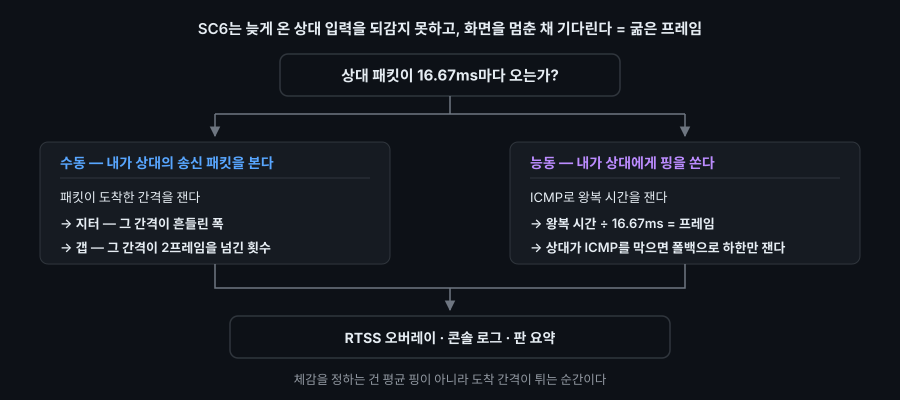

# sc6-ping

소울칼리버 6의 P2P(두 PC를 서버 없이 직접 잇는 통신) 대전에서 상대의 패킷이 내 PC에 어떤 간격으로 도착하는지를 측정하는 프로젝트.

SC6와 스팀이 점유한 User Datagram Protocol(UDP) 포트만 골라 캡처한다. 송신된 패킷에서 읽는 건 출발지·도착지 주소와 도착 시각뿐이고, 내용은 파싱하지 않는다.

- 사용 도구 — Python · scapy/Npcap 패킷 캡처 · Internet Control Message Protocol(ICMP, IP 계층에서 발생한 전달 실패·경로 이상·상태 조회를 통보하기 위한 제어 전용 프로토콜) 능동 측정 · RivaTuner Statistics Server(RTSS, 게임 화면 위에 글자를 덧그리는 프로그램) 오버레이
- 실행 환경 — Windows 11 · Npcap · RTSS · 게임 소유가 전제다
- 통신 — 외부로 나가는 통신이 없다. 국가·인터넷 사업자(ISP) 조회까지 로컬 대역표로 한다

# 만든 이유

- 렉이 걸리는 이유는 어렴풋이 알지만 실제로 무엇이 문제인지 설명할 수 없다는 점
- 게임 GUI로 표시해주는 핑 환경과 실제 체감 차이의 괴리감
- 유튜브로 게임화면을 송출하면서 게임할 때 네트워크 상에서 어떤 일이 발생되는지?
- 일본·대만의 유저가 매칭되었을 때 느껴지는 핑이 국내 유저의 핑보다 더 좋게 느껴지는 이유는?

# 측정 대상



게임 화면은 1초에 60장을 그리므로 1프레임은 약 16.67ms다. 패킷을 보내도 받는 시간이 "49ms 걸렸다"라는 뜻은 게임에서 약 "3프레임 정도 밀렸다"로 해석할 수 있고 이것을 렉이라고 한다.

넷코드는 게임 업계나 커뮤니티에서 만들어진 은어로, 보통 온라인(네트워크)에서 여러 클라이언트가 하나의 게임 상태를 일관되게 유지하도록 만드는 코드 전반을 의미한다.

이 게임의 네트워크 설계는 "딜레이 기반 넷코드" 방식이다. 네트워크 지연이 발생하면, 딜레이 기반 넷코드는 플레이어의 버튼 입력 처리를 일정 시간 지연시킨다. 이를 통해 각 플레이어의 게임 상태를 동기화하고 안정적인 진행을 유지한다. 지연된 시간 안에 입력이 안 오면 화면을 멈춘 채 그 입력이 오기를 대기하는 상태가 렉이다. 측정 방식은 2가지를 사용했고 패킷이 16.67ms마다 오는가? 를 확인한다.

- 수동 — 상대 패킷의 도착 간격에서 지터(상위 5% 지점 p95에서 중앙값 p50을 뺀 값)와 측정한 ms 를 프레임으로 치환하여 '프레임 갭'을 낸다.
- 능동 — ICMP로 왕복 시간을 재고 프레임으로 환산한다. 하지만 ICMP를 막아놓았다면 능동적으로 측정이 불가능하고, 상대 공유기 입장에선 부른 적 없는 패킷이라 버린다. 그 때는 TTL(패킷이 지날 수 있는 라우터 수) 폴백으로 마지막 응답 홉까지만 재서 하한(>=)을 낸다. 안타깝게도 측정시 대부분의 공유기에서는 ICMP를 막아놓았다.

# 관측 화면 — 모니터링 로그

- 오늘 오후 중으로 올릴예정

# 관측 화면 — 게임 내 오버레이

=55ms, >=3.3프레임, 지터 1.1, 갭 0.0" src="docs/overlay.png" width="900">

# 관측 화면 — 판 종료 결과

```
[판 종료] 14.XXX.XXX.XXX  한국 · Korea Telecom (AS4766)   3분 18초
  평가  A   (핑 A / 지터 A / 갭 A)
  핑    4.4ms → 0.3프레임 왕복 (편도 0.1)
  간격  16.3ms
  지터  중앙 1.0ms   최대 98.0ms
  갭    18회   최악 128ms   (5.5회/분)
  굶음  42프레임 / 11,880   (0.35%)
```

- 핑: 나와 상대 사이의 패킷의 왕복 지연 시간. ICMP를 열어놓은 상대에게는 왕복시간을 표시하며, 게임에서 체감되는 입력 전달 시간을 보기 위해 편도 지연(왕복 / 2)를 기준으로 등급을 계산.
- 간격: 상대의 패킷이 얼마나 일정한 간격으로 도착하는지를 의미. 16.67ms(1프레임)마다 패킷을 전송하면 정상적인 도착간격은 16.67ms이고, 중앙값(median, p50)이 이 값에 가까울수록 안정적이다.
- 지터: 상대의 패킷 도착 간격이 얼마나 불규칙하게 흔들렸는지를 나타내는 항목. 평소의 도착간격과 느리게 도착한 패킷들의 간격차이를 비교해서 계산. 값이 클수록 패킷이 일정하지 않게 도착했다는 의미이다.
- 갭: 상대의 패킷이 제 시간에 도착하지 않아서 2프레임 이상 비어진 순간의 횟수. 값이 많을 수록 게임이 상대 입력을 기다리면서 멈추거나 끊기는 상황이 자주 발생했다는것을 의미.
- 굶음: 상대의 패킷이 늦게 도착해 게임이 입력을 기다린 프레임의 총합.
  갭이 발생한 횟수뿐 아니라, 게임에서 오랫동안 입력이 되는데 걸린 프레임을 나타낸다.
- 평가: 상대와 시합이 끝나면 시합 동안의 통신 환경을 평가해 A~D로 매긴 값. 내 회선이 아니라 나와 그 상대 사이 경로 전체를 평가한다. A가 최적 D가 최악으로 점수를 매긴다.

# 측정하고 알게된 사실들

| 몰랐던 점                        | 알게된 것                                                                                                                                                                                                                                |
| -------------------------------- | ---------------------------------------------------------------------------------------------------------------------------------------------------------------------------------------------------------------------------------------- |
| 다른 유저와 매칭되면 일어나는 일 | 두 플레이어는 Steam의 도움을 받아 서로 연결을 시도한다. 직접 연결이 가능한 경우 양쪽에서 UDP 패킷을 주고받아 NAT 매핑을 생성하고, 이를 통해 P2P 통신 경로를 생선한다(UDP 홀 펀칭)                                                        |
| UDP 사용 이유                    | UDP는 재전송과 순서보장을 강제하지 않는다. 오래된 사용자의 입력 데이터가 뒤늦게 도착하면 게임의 일관성을 보장하지 못한다. 따라서 최신 상태를 빠르게 전달하는것이 중요하다.                                                               |
| 딜레이 넷코드                    | 두 PC가 같은 상대의 입력이 도착할 때까지 게임 진행을 일정 시간 지연시키는 방식을 의미 ([참고링크](https://arstechnica.com/gaming/2019/10/explaining-how-fighting-games-use-delay-based-and-rollback-netcode/))                           |
| 렉의 정체                        | 게임은 입력을 몇 ms 뒤에 적용하도록 '입력딜레이'를 두는 동안 상대의 입력 패킷이 도착할 수 있다. 일정 수준의 네트워크 지연은 자연스럽게 흡수되지만 패킷 도착이 불규칙하면 게임은 기다리지 못하고 멈춤이나 끊김이 발생한다. 이것이 렉이다. |
| 스트리밍을 켜면 어떤일이?        | PC에서 인터넷으로 나가는 업로드 경로(업링크)가 많은 데이터 누적으로 바빠진다. 이 때 보내야할 게임패킷을 전송하지 못하고 다른 패킷 뒤에서 기다리게 되면서, 상대가 받아야할 게임패킷이 늦게 도착하게 된다. 결국 지연이나 끊김이 발생한다.  |
| 국내 매칭이 왜 더 불안정?        | 게임 데이터 패킷이 얼마나 일정한 시간에 도착하느냐의 일관성의 문제이다. 지연율이 낮아도 도착 시간이 일정하지 않으면 게임의 일관성은 떨어지기에 불안정하게 느겨진다.                                                                      |
|                                  |

</br>

# 계층으로 보는 추측성 진단과 앱에서 가능한 것

패킷이 지나는 순서대로 쌓으면 다섯 층 정도로 구분이 되며 진단도 이 순서로 짚는다.

| 층  | 예상되는 진단                                                                                      | 진단앱에서 측정 가능?                                                         |
| --- | -------------------------------------------------------------------------------------------------- | ----------------------------------------------------------------------------- |
| L1  | 내 PC의 프레임 드랍 · 인코딩 부하                                                                  | 안 보인다. 패킷 수신만 측정                                                   |
| L2  | 내 공유기 · 회선, 업로드가 꽉 차서 내 패킷이 줄 뒤에 서는 Bufferbloat 현상 · VPN 전체 터널 · Wi-Fi | VPN은 [*] 로컬 IP 한 줄로 판별                                                |
| L3  | ISP와 백본 구간. 거리가 지연을 만들고, 거쳐 가는 라우터마다 서는 줄이 흔들림을 만들 때             | 간헐적 큰 갭이 측정 될 수 있지만 확실히 알수 없고 시간대에 따라 달라질수 있음 |
| L4  | 상대 공유기 · 회선, 상대의 업로드 포화(방송 송출 등)                                               | 간격이 한 프레임(16.67ms)보다 짧아짐. 패킷이 몰려서 옴                        |
| L5  | 상대 PC의 이유로 상대의 프레임 드랍으로 송신 간격이 흔들린다                                       | 구별 할 수 없다. L4와 혼동 될 가능성도 있다.                                  |

# 측정 후 알게 된 사실들

좀 더 많은 + 일관성 있게 데이터 로그 측정 하면서 작성 중

# 한계

- 상대 패킷이 내 NIC에 어떻게 도착했는지에 따른 수치는 알 수 있지만 패킷이 왜 늦게 도착했는지에 대한 원인 파악은 알 수 없다.
- 상대의 대부분이 ICMP를 막는것을 확인했다.
- 등급 A와 B의 체감상 어떤 부분이 달랐는지 느낌으로는 알지만, 타인에게 수치적으로 설명하기 애매하다

# 배운 것

- 상황에 적합한 프로토콜 선정의 중요성. TCP는 패킷의 순서와 전달을 보장하지만 중간 패킷이 유실되면 재전송을 기다리는 동안 뒤에 도착한 데이터까지 지연될 수 있다. UDP는 기다리지 않고 새 패킷을 처리한다.</br>

- 평균 응답시간이 낮다고 해서 게임의 동시성도 보장할 수 없는 것 처럼, E-커머스의 결제 API나 스트리밍 서비스 처럼 일부 요청의 지연이 UX에 영향을 주는 시스템에서는 p95나 p99와 같은 tail latency가 더 중요한 지표가 될 수 있다. 게임의 Jitter를 보는 것처럼 현업에서도 tail latency와 연결될 수 있음을 알게 되었다.

- 입력딜레이는 입력을 즉시 반영하지 않고 몇 ms 뒤에 처리할 수 있도록 여유시간을 둔 장치인데, 이 시간동안 상대의 패킷이 도착하면 네트워크의 흔들림(지터)를 흡수 할 수 있다. 라우터나 NIC가 순간적으로 패킷이 몰리면 송신버퍼에 잠시 쌓아 두지만 처리가 안되면 버퍼 플로트로 이어진다. 공통적으로 순간적인 변동을 없애지 않고 기다리는 공간을 만들어 흡수한다는 구조를 사용한다.

### 해당 앱을 실행하기 위해서는 다음의 프로그램 설치가 필요

- 필수: Windows 11 · Npcap 1.88 · Python 3.11 · uv 0.9.21 · scapy 2.7.0 · psutil 7.2.2 ·
  게임(MacOS 지원안함)
- 선택: RTSS 7.3.7(오버레이) · ip2asn-v4.tsv(국가·ISP 표시).

# 실행

```powershell
uv run monitor.py
```

- 게임내 오버레이 필요시 RTSS → 게임 → monitor.py 순서로 켠다. 실행 로그는 스크립트 시작 시간 기준으로 `run-{오늘날짜}-{현재시간}` 파일의 log 파일이 생성된다
